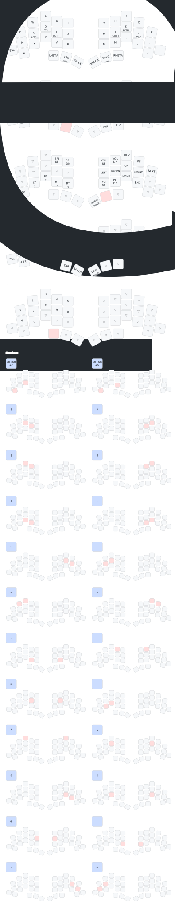

<picture>
  <source media="(prefers-color-scheme: dark)" srcset="/docs/images/TOTEM_logo_dark.svg">
  <source media="(prefers-color-scheme: light)" srcset="/docs/images/TOTEM_logo_bright.svg">
  
</picture>

# ZMK CONFIG FOR THE TOTEM SPLIT KEYBOARD

TOTEM is a 38 key column-staggered split keyboard running [ZMK](https://zmk.dev/) or [QMK](https://docs.qmk.fm/). It's meant to be used with a SEEED XIAO BLE or RP2040.

